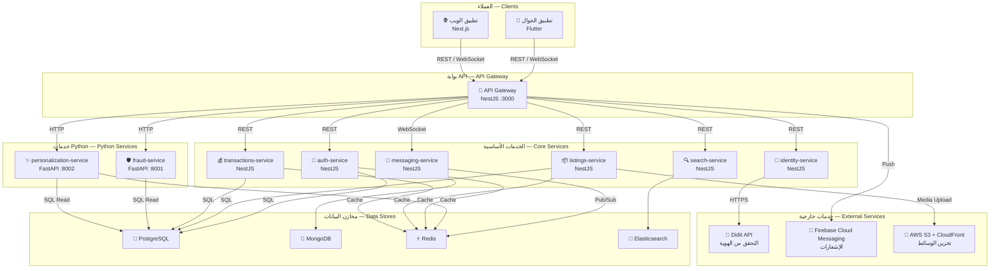
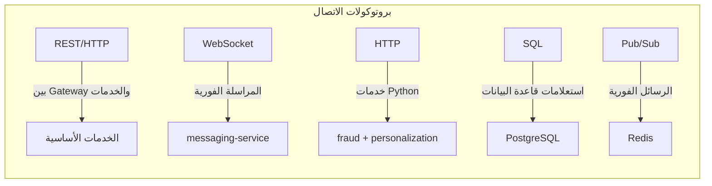
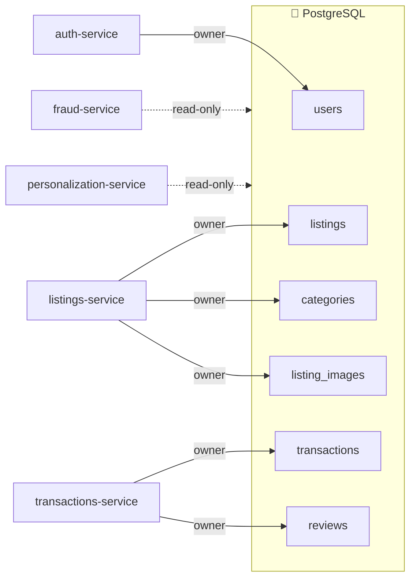

# البنية المعمارية — System Architecture

> معرض الأشياء — Ma'rad Al-Ashya' C2C Marketplace

## نظرة عامة

يعتمد المشروع على بنية **Microservices** (خدمات مصغرة) حيث تتولّى كل خدمة مسؤولية محددة. جميع الخدمات تتواصل عبر **API Gateway** مركزي يعمل كنقطة دخول وحيدة للتطبيقات العميلة.

---

## مخطط البنية المعمارية

---

## وصف الخدمات

### 1. بوابة API — API Gateway

| الخاصية | القيمة |
|---------|--------|
| **التقنية** | NestJS |
| **المنفذ** | `3000` |
| **البروتوكول** | REST + WebSocket |
| **المسؤولية** | نقطة الدخول الوحيدة لجميع الطلبات، التوجيه (Routing)، المصادقة (Authentication)، تحديد المعدّل (Rate Limiting) |

---

### 2. خدمة المصادقة — auth-service

| الخاصية | القيمة |
|---------|--------|
| **التقنية** | NestJS |
| **قاعدة البيانات** | PostgreSQL (جدول `users`) |
| **المسؤولية** | تسجيل الدخول / الخروج، التحقق من OTP، إصدار وتحقق JWT، تسجيل عبر Google/Apple |

---

### 3. خدمة الإعلانات — listings-service

| الخاصية | القيمة |
|---------|--------|
| **التقنية** | NestJS |
| **قاعدة البيانات** | PostgreSQL (جداول `listings`, `categories`, `listing_images`) |
| **المسؤولية** | إنشاء وتعديل وحذف الإعلانات، إدارة التصنيفات، رفع الصور |

---

### 4. خدمة البحث — search-service

| الخاصية | القيمة |
|---------|--------|
| **التقنية** | NestJS |
| **قاعدة البيانات** | Elasticsearch |
| **المسؤولية** | البحث النصي الكامل (Full-text Search)، التصفية المتقدمة، البحث الجغرافي |

---

### 5. خدمة المراسلة — messaging-service

| الخاصية | القيمة |
|---------|--------|
| **التقنية** | NestJS |
| **قاعدة البيانات** | MongoDB + Redis (Pub/Sub) |
| **البروتوكول** | WebSocket |
| **المسؤولية** | المحادثات الفورية بين البائع والمشتري، إشعارات الرسائل |

---

### 6. خدمة المعاملات — transactions-service

| الخاصية | القيمة |
|---------|--------|
| **التقنية** | NestJS |
| **قاعدة البيانات** | PostgreSQL (جداول `transactions`, `reviews`) |
| **المسؤولية** | إدارة عمليات البيع والشراء، تتبّع حالة التسليم، التقييمات |

---

### 7. خدمة التحقق من الهوية — identity-service

| الخاصية | القيمة |
|---------|--------|
| **التقنية** | NestJS |
| **خدمة خارجية** | Didit API |
| **المسؤولية** | التحقق من هوية المستخدمين عبر مزوّد خارجي (KYC) |

---

### 8. خدمة كشف الاحتيال — fraud-service

| الخاصية | القيمة |
|---------|--------|
| **التقنية** | Python FastAPI |
| **المنفذ** | `8001` |
| **قاعدة البيانات** | PostgreSQL (قراءة فقط) |
| **مكتبات ML** | scikit-learn |
| **المسؤولية** | تحليل الإعلانات والسلوكيات المشبوهة، تصنيف مخاطر الاحتيال |

---

### 9. خدمة التخصيص — personalization-service

| الخاصية | القيمة |
|---------|--------|
| **التقنية** | Python FastAPI |
| **المنفذ** | `8002` |
| **قاعدة البيانات** | PostgreSQL (قراءة فقط) + Redis (تخزين مؤقت) |
| **المسؤولية** | توصيات مخصصة للمستخدمين، ترتيب الإعلانات حسب التفضيلات |

---

## بروتوكولات الاتصال — Communication Protocols

| البروتوكول | الاستخدام |
|-----------|-----------|
| **REST/HTTP** | التواصل بين API Gateway والخدمات الأساسية (NestJS) |
| **HTTP** | التواصل بين API Gateway وخدمات Python (FastAPI) |
| **WebSocket** | المراسلة الفورية عبر `messaging-service` |
| **SQL** | استعلامات قاعدة البيانات PostgreSQL |
| **Pub/Sub (Redis)** | توزيع الرسائل الفورية بين مثيلات `messaging-service` |
| **HTTPS** | الاتصال بالخدمات الخارجية (Didit API, FCM, S3) |

---

## ملكية قواعد البيانات — Database Ownership

كل خدمة تمتلك مجموعة محددة من الجداول أو مخازن البيانات:

| الخدمة | مخزن البيانات | الوصول |
|--------|--------------|--------|
| `auth-service` | PostgreSQL — `users` | قراءة وكتابة (Owner) |
| `listings-service` | PostgreSQL — `listings`, `categories`, `listing_images` | قراءة وكتابة (Owner) |
| `search-service` | Elasticsearch | قراءة وكتابة (Owner) |
| `messaging-service` | MongoDB + Redis | قراءة وكتابة (Owner) |
| `transactions-service` | PostgreSQL — `transactions`, `reviews` | قراءة وكتابة (Owner) |
| `fraud-service` | PostgreSQL | قراءة فقط |
| `personalization-service` | PostgreSQL + Redis | قراءة فقط (PG) + تخزين مؤقت (Redis) |

---

## الخدمات الخارجية — External Services

| الخدمة | المزوّد | الاستخدام |
|--------|--------|-----------|
| **التحقق من الهوية** | Didit API | التحقق من هوية المستخدمين (KYC) |
| **الإشعارات** | Firebase Cloud Messaging | إشعارات الجوال (Push Notifications) |
| **تخزين الوسائط** | AWS S3 + CloudFront | تخزين وتوزيع الصور والملفات |

---

## ملاحظات معمارية

> [!IMPORTANT]
> كل خدمة مستقلة تمامًا ولها قاعدة بيانات خاصة (أو مجموعة جداول خاصة). لا تتواصل الخدمات مباشرة مع بعضها، بل عبر API Gateway.

> [!NOTE]
> خدمات Python (fraud-service و personalization-service) تعمل كخدمات مساندة وتقرأ فقط من قاعدة البيانات. لا تقوم بأي عمليات كتابة مباشرة.

> [!TIP]
> في المراحل القادمة، يمكن إضافة Message Broker (مثل RabbitMQ أو Kafka) للتواصل غير المتزامن بين الخدمات عند الحاجة.
