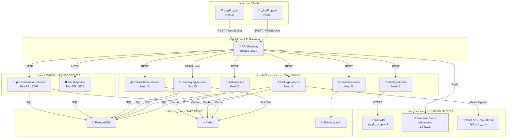
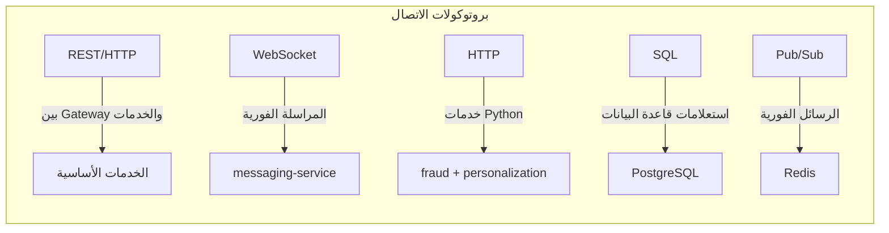

# البنية المعمارية — System Architecture

> معرض الأشياء — Ma'rad Al-Ashya' C2C Marketplace

## نظرة عامة

يعتمد المشروع على بنية **Microservices** (خدمات مصغرة) حيث تتولّى كل خدمة مسؤولية محددة. جميع الخدمات تتواصل عبر **API Gateway** مركزي يعمل كنقطة دخول وحيدة للتطبيقات العميلة.

---

## مخطط البنية المعمارية



---

## وصف الخدمات

### 1. بوابة API — API Gateway

| الخاصية | القيمة |
|---------|--------|
| **التقنية** | NestJS |
| **المنفذ** | `3000` |
| **البروتوكول** | REST + WebSocket |
| **المسؤولية** | نقطة الدخول الوحيدة لجميع الطلبات، التوجيه (Routing)، المصادقة (Authentication)، تحديد المعدّل (Rate Limiting) |

---

### 2. خدمة المصادقة — auth-service

| الخاصية | القيمة |
|---------|--------|
| **التقنية** | NestJS |
| **قاعدة البيانات** | PostgreSQL (جدول `users`) |
| **المسؤولية** | تسجيل الدخول / الخروج، التحقق من OTP، إصدار وتحقق JWT، تسجيل عبر Google/Apple |

---

### 3. خدمة الإعلانات — listings-service

| الخاصية | القيمة |
|---------|--------|
| **التقنية** | NestJS |
| **قاعدة البيانات** | PostgreSQL (جداول `listings`, `categories`, `listing_images`) |
| **المسؤولية** | إنشاء وتعديل وحذف الإعلانات، إدارة التصنيفات، رفع الصور |

---

### 4. خدمة البحث — search-service

| الخاصية | القيمة |
|---------|--------|
| **التقنية** | NestJS |
| **قاعدة البيانات** | Elasticsearch |
| **المسؤولية** | البحث النصي الكامل (Full-text Search)، التصفية المتقدمة، البحث الجغرافي |

---

### 5. خدمة المراسلة — messaging-service

| الخاصية | القيمة |
|---------|--------|
| **التقنية** | NestJS |
| **قاعدة البيانات** | PostgreSQL + Redis (الحضور) |
| **البروتوكول** | WebSocket |
| **المسؤولية** | المحادثات الفورية بين البائع والمشتري، إشعارات الرسائل |

---

### 6. خدمة المعاملات — transactions-service

| الخاصية | القيمة |
|---------|--------|
| **التقنية** | NestJS |
| **قاعدة البيانات** | PostgreSQL (جداول `transactions`, `reviews`) |
| **المسؤولية** | إدارة عمليات البيع والشراء، تتبّع حالة التسليم، التقييمات |

---

### 7. خدمة التحقق من الهوية — identity-service

| الخاصية | القيمة |
|---------|--------|
| **التقنية** | NestJS |
| **خدمة خارجية** | Didit API |
| **المسؤولية** | التحقق من هوية المستخدمين عبر مزوّد خارجي (KYC) |

---

### 8. خدمة كشف الاحتيال — fraud-service

| الخاصية | القيمة |
|---------|--------|
| **التقنية** | Python FastAPI |
| **المنفذ** | `8001` |
| **قاعدة البيانات** | PostgreSQL (قراءة فقط) |
| **مكتبات ML** | scikit-learn |
| **المسؤولية** | تحليل الإعلانات والسلوكيات المشبوهة، تصنيف مخاطر الاحتيال |

---

### 9. خدمة التخصيص — personalization-service

| الخاصية | القيمة |
|---------|--------|
| **التقنية** | Python FastAPI |
| **المنفذ** | `8002` |
| **قاعدة البيانات** | PostgreSQL (قراءة فقط) + Redis (تخزين مؤقت) |
| **المسؤولية** | توصيات مخصصة للمستخدمين، ترتيب الإعلانات حسب التفضيلات |

---

## بروتوكولات الاتصال — Communication Protocols



| البروتوكول | الاستخدام |
|-----------|-----------|
| **REST/HTTP** | التواصل بين API Gateway والخدمات الأساسية (NestJS) |
| **HTTP** | التواصل بين API Gateway وخدمات Python (FastAPI) |
| **WebSocket** | المراسلة الفورية عبر `messaging-service` |
| **SQL** | استعلامات قاعدة البيانات PostgreSQL |
| **Pub/Sub (Redis)** | توزيع الرسائل الفورية بين مثيلات `messaging-service` |
| **HTTPS** | الاتصال بالخدمات الخارجية (Didit API, FCM, S3) |

---

## ملكية البيانات — Data Ownership

> المصدر الرسمي: رؤوس ملفات `db/migrations/` (0001 و0003 و0004). **قاعدة البيانات الوحيدة هي PostgreSQL** ([POSTGRES.md](POSTGRES.md)). **فقط المالك يكتب**؛ غيره يمر عبر واجهة المالك.

| الخدمة | المخزن | الجداول / المجموعات |
|--------|--------|---------------------|
| `auth-service` | PostgreSQL | `users` (أعمدة الهوية: الهاتف، البريد، كلمة المرور، الدور، الحالة، OAuth) |
| `users-service` | PostgreSQL | `users` (أعمدة الملف الشخصي والإشعارات فقط) + Redis (المفضلة) |
| `listings-service` | PostgreSQL + Redis | `categories`, `listings`, `listing_images`, `promotions` + عدّادات المشاهدات |
| `transactions-service` | PostgreSQL | `transactions`, `reviews`, `user_rating_summary` |
| `moderation-service` | PostgreSQL + Redis (Bull) | `reports`, `report_counts` |
| `identity-service` | PostgreSQL | `kyc_verifications`, `kyc_audit_logs` (بيانات مشفّرة بـ KMS) |
| `search-service` | Elasticsearch + PostgreSQL | فهرس `marad_listings` + `ab_test_results` |
| `messaging-service` | PostgreSQL + Redis | `conversations`, `conversation_members`, `messages` + الحضور |
| `fraud-service` | PostgreSQL | `fraud_signals`, `device_accounts`, `ip_accounts`, `transaction_features` |
| `personalization-service` | PostgreSQL + Redis + ES | `user_events` (مقسّم شهرياً) + قراءة الفهرس |

**الترحيلات:** ملف SQL مرقّم في `db/migrations/NNNN_وصف.sql`، يطبّقه `db/migrate.mjs` (مع checksum وقفل استشاري وتنفيذ كل ملف في transaction). في Docker تعمل خدمة `migrate` مرة واحدة قبل أي خدمة تستخدم Postgres. في CI يُطبَّق كل شيء على قاعدة فارغة مرتين، ثم يتحقق `scripts/check-entity-schema.ts` من أن كل عمود في كيانات TypeORM موجود بنوع متوافق.

---

## التوجيه عبر البوابة — Gateway Routing

`/api/v1/{prefix}/...` → الخدمة حسب `services/api-gateway/src/proxy/services.config.ts`:

| الآلية | الغرض |
|--------|-------|
| `stripPrefix: false` | للخدمات التي تركّب متحكماتها تحت نفس الاسم (`@Controller('listings')`) |
| `ROUTE_OVERRIDES` | مسار عام تملكه خدمة أخرى: `/users/:id/reviews` → transactions-service |
| `BLOCKED_ROUTES` | مسارات داخلية لا تُعرض للعامة أبداً (دفاع إضافي فوق `INTERNAL_SECRET`) |
| `cacheableRoutes` | كاش Redis قصير للقراءات المجهولة على مسارات القوائم فقط |

**العقود:** `scripts/check-contracts.mjs` يستخرج كل استدعاء من الويب والجوال، ويمرره عبر خريطة البوابة، ويتحقق من وجود مسار مطابق (NestJS/FastAPI) — يعمل في CI.

---

## المراقبة والمؤشرات — Observability

| الطبقة | ماذا | أين |
|---|---|---|
| مؤشرات الأعمال | كل خدمة تحسب مؤشرات جداولها في `GET …/admin/stats` (مشرف فقط، كاش 60s، نافذة 30 يوماً مفهرسة) | لوحة `/admin` في الويب |
| مقاييس الطلبات | البوابة تقيس المعدل والأخطاء وزمن الاستجابة لكل خدمة، وكاش الاستجابات، وصحة كل خدمة | Prometheus ← Grafana (`operations.json`) |
| مقاييس العمليات | `/metrics` داخلي في كل خدمة؛ البوابة ترفض تمريره للعامة، و`/metrics` البوابة يتطلب `METRICS_TOKEN` | Prometheus |
| السجلات | سطر JSON لكل حدث في كل الخدمات الـ11، وسطر `HTTP` لكل طلب (المسار بلا query، الحالة، المدة) | stdout ← `docker logs` |
| الأخطاء | كل 5xx غير متوقع يُرسل مع وسم `request_id`، بعد تنظيف بيانات الطلب | Sentry |

التفاصيل في [DASHBOARD.md](DASHBOARD.md).

### السجلات ومعرّف الطلب — Logs and request IDs

كل طلب يحمل `X-Request-ID`: البوابة تأخذه من العميل إن كان صالحاً (8–128 حرفاً من `A-Za-z0-9._:-`) وإلا تولّده، وتعيده في الاستجابة، وتمرّره للخدمات. كل خدمة تكتبه في كل سطر سجل أثناء معالجة الطلب، وتمرّره تلقائياً في استدعاءاتها للخدمات الأخرى (`fetch` و axios/`HttpService`، للمضيفات الداخلية فقط). لتتبّع طلب واحد عبر كل الخدمات:

```bash
docker compose -f infra/docker-compose.yml logs --no-log-prefix | grep '"requestId":"<id>"'
```

```json
{"time":"2026-09-30T12:00:00.123Z","level":"info","service":"listings-service","context":"HTTP","requestId":"4b1e…","msg":"request","method":"POST","path":"/listings","status":201,"durationMs":42.7}
```

- **لا يُسجَّل أبداً:** قيم الحقول الحساسة (كلمات المرور، OTP، التوكنات، الأسرار، الهواتف، أرقام الهوية والبطاقات، ترويسات `authorization`/`cookie`/التواقيع)، وداخل النصوص: JWT وقيم `Bearer` ومعاملات `?token=`/`?code=` وأرقام الهواتف، والبريد يُختصر إلى `s***@example.com`. القواعد نفسها تُطبّق على أحداث Sentry.
- **المستويات:** `LOG_LEVEL` = `debug` | `info` | `warn` | `error` (الافتراضي `info` في الإنتاج و`debug` محلياً). `LOG_FORMAT=pretty` لسطر مقروء أثناء التطوير.
- **استعلامات SQL:** لا تُسجَّل قيم المعاملات أبداً (فيها بريد وهواتف وتجزئات كلمات مرور). الاستعلامات الفاشلة، والأبطأ من `DB_SLOW_QUERY_MS` (افتراضياً 1000)، تُسجَّل دائماً؛ وكل استعلام على مستوى debug فقط مع `LOG_SQL=true`.
- **في الكود:** `new Logger('Context').log(...)` كما هو؛ ولإضافة حقول: `this.logger.log({ msg: 'listing published', listingId })`. لا تستخدم `console.log` في الخدمات.
- الملفات: `src/common/logging.ts` (NestJS) و`logging_setup.py` (خدمتا Python)، بصيغة واحدة.

---

## الأمان بين الخدمات — Service Security Model

| الاتجاه | الآلية |
|---------|--------|
| عميل → خدمة | JWT (HS256) يصدره auth-service؛ كل خدمة تتحقق من التوقيع بـ `JWT_ACCESS_SECRET` (`common/security.ts`) |
| خدمة → خدمة | ترويسة `x-internal-secret` تُقارن بزمن ثابت (`InternalGuard`)؛ البوابة لا تمررها من العملاء |
| مزوّد خارجي → خدمة | توقيع HMAC على الجسم الخام (Stripe، Didit) |
| مدير | دور `admin` داخل JWT (`AdminGuard`) |

الملفات المشتركة (`common/security.ts`, `common/database.ts`, `common/logging.ts`) منسوخة في كل خدمة لأن سياق بناء Docker هو مجلد الخدمة؛ `scripts/check-shared-copies.mjs` يمنع اختلاف النسخ.

---

## الخدمات الخارجية — External Services

| الخدمة | المزوّد | الاستخدام |
|--------|--------|-----------|
| **التحقق من الهوية** | Didit API | التحقق من هوية المستخدمين (KYC) |
| **الإشعارات** | Firebase Cloud Messaging | إشعارات الجوال (Push Notifications) |
| **تخزين الوسائط** | AWS S3 + CloudFront | تخزين وتوزيع الصور والملفات |

---

## قرارات معمارية — Architecture Decisions

1. **قاعدة Postgres واحدة بملكية جداول صارمة** بدلاً من قاعدة لكل خدمة: أبسط تشغيلياً في هذه المرحلة؛ الحدود تُفرض بالملكية الموثّقة ومراجعة الكود. الانتقال لقواعد منفصلة ممكن لاحقاً لأن لا خدمة تنفّذ JOIN على جداول غيرها.
2. **الاتصال المتزامن بين الخدمات مؤقت:** الفهرسة والإشعارات وتحليل الاحتيال تُستدعى HTTP الآن (بلا انتظار حيث أمكن). المرحلة 2: جدول Outbox + طابور (BullMQ) حتى لا يضيع أي حدث.
3. **نسخ الملفات المشتركة بدل حزمة workspace:** إلى أن تنتقل صور Docker للبناء من جذر المستودع (عندها تصبح `packages/common`).
4. **HS256 بسر مشترك:** مقبول داخل شبكة خاصة؛ المرحلة 4: RS256 بحيث لا تملك الخدمات إلا المفتاح العام.
