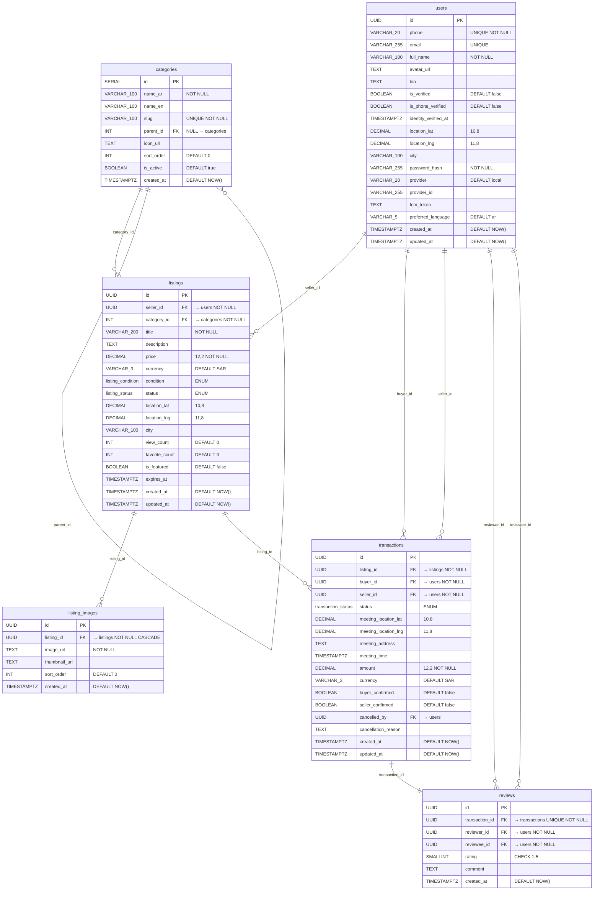

# مخطط قاعدة البيانات — Database Schema

> معرض الأشياء — Ma'rad Al-Ashya' C2C Marketplace

## نظرة عامة

يعتمد المشروع على قاعدة بيانات **PostgreSQL** كمخزن بيانات رئيسي. يتكوّن المخطط من **6 جداول أساسية** تغطي جميع الكيانات المطلوبة لسوق البيع والشراء بين الأفراد (C2C).

---

## مخطط العلاقات (ERD)

---

## وصف الجداول التفصيلي

### 1. جدول المستخدمين — `users`

يخزّن بيانات جميع المستخدمين المسجّلين في المنصة (بائعين ومشترين).

| العمود | النوع | القيود | الوصف |
|--------|-------|--------|-------|
| `id` | `UUID` | `PK, DEFAULT uuid_generate_v4()` | المعرّف الفريد |
| `phone` | `VARCHAR(20)` | `UNIQUE NOT NULL` | رقم الهاتف (للتسجيل والتحقق) |
| `email` | `VARCHAR(255)` | `UNIQUE` | البريد الإلكتروني (اختياري) |
| `full_name` | `VARCHAR(100)` | `NOT NULL` | الاسم الكامل |
| `avatar_url` | `TEXT` | — | رابط صورة الملف الشخصي |
| `bio` | `TEXT` | — | نبذة عن المستخدم |
| `is_verified` | `BOOLEAN` | `DEFAULT false` | حالة التحقق العامة |
| `is_phone_verified` | `BOOLEAN` | `DEFAULT false` | هل تم التحقق من رقم الهاتف |
| `identity_verified_at` | `TIMESTAMPTZ` | — | تاريخ التحقق من الهوية |
| `location_lat` | `DECIMAL(10,8)` | — | خط العرض |
| `location_lng` | `DECIMAL(11,8)` | — | خط الطول |
| `city` | `VARCHAR(100)` | — | المدينة |
| `password_hash` | `VARCHAR(255)` | `NOT NULL` | كلمة المرور المشفّرة |
| `provider` | `VARCHAR(20)` | `DEFAULT 'local'` | مزوّد التسجيل (local, google, apple) |
| `provider_id` | `VARCHAR(255)` | — | معرّف المزوّد الخارجي |
| `fcm_token` | `TEXT` | — | رمز Firebase Cloud Messaging |
| `preferred_language` | `VARCHAR(5)` | `DEFAULT 'ar'` | اللغة المفضّلة |
| `created_at` | `TIMESTAMPTZ` | `DEFAULT NOW()` | تاريخ الإنشاء |
| `updated_at` | `TIMESTAMPTZ` | `DEFAULT NOW()` | تاريخ آخر تحديث |

---

### 2. جدول التصنيفات — `categories`

يدعم التصنيفات الهرمية (شجرية) عبر العمود `parent_id` الذي يشير إلى نفس الجدول.

| العمود | النوع | القيود | الوصف |
|--------|-------|--------|-------|
| `id` | `SERIAL` | `PK` | المعرّف التسلسلي |
| `name_ar` | `VARCHAR(100)` | `NOT NULL` | اسم التصنيف بالعربية |
| `name_en` | `VARCHAR(100)` | — | اسم التصنيف بالإنجليزية |
| `slug` | `VARCHAR(100)` | `UNIQUE NOT NULL` | المعرّف النصي للروابط |
| `parent_id` | `INT` | `FK → categories, NULL` | التصنيف الأب (للتصنيفات الفرعية) |
| `icon_url` | `TEXT` | — | رابط أيقونة التصنيف |
| `sort_order` | `INT` | `DEFAULT 0` | ترتيب العرض |
| `is_active` | `BOOLEAN` | `DEFAULT true` | هل التصنيف مفعّل |
| `created_at` | `TIMESTAMPTZ` | `DEFAULT NOW()` | تاريخ الإنشاء |

---

### 3. جدول الإعلانات — `listings`

يمثّل المنتجات المعروضة للبيع. يستخدم نوعين مخصصين (ENUM) لحالة المنتج وحالة الإعلان.

| العمود | النوع | القيود | الوصف |
|--------|-------|--------|-------|
| `id` | `UUID` | `PK, DEFAULT uuid_generate_v4()` | المعرّف الفريد |
| `seller_id` | `UUID` | `FK → users, NOT NULL` | معرّف البائع |
| `category_id` | `INT` | `FK → categories, NOT NULL` | معرّف التصنيف |
| `title` | `VARCHAR(200)` | `NOT NULL` | عنوان الإعلان |
| `description` | `TEXT` | — | وصف المنتج |
| `price` | `DECIMAL(12,2)` | `NOT NULL` | السعر |
| `currency` | `VARCHAR(3)` | `DEFAULT 'SAR'` | العملة |
| `condition` | `listing_condition` | — | حالة المنتج: `new`, `like_new`, `good`, `fair`, `poor` |
| `status` | `listing_status` | — | حالة الإعلان: `draft`, `active`, `sold`, `expired`, `removed` |
| `location_lat` | `DECIMAL(10,8)` | — | خط العرض |
| `location_lng` | `DECIMAL(11,8)` | — | خط الطول |
| `city` | `VARCHAR(100)` | — | المدينة |
| `view_count` | `INT` | `DEFAULT 0` | عدد المشاهدات |
| `favorite_count` | `INT` | `DEFAULT 0` | عدد المفضّلات |
| `is_featured` | `BOOLEAN` | `DEFAULT false` | هل الإعلان مميّز |
| `expires_at` | `TIMESTAMPTZ` | — | تاريخ انتهاء الصلاحية |
| `created_at` | `TIMESTAMPTZ` | `DEFAULT NOW()` | تاريخ الإنشاء |
| `updated_at` | `TIMESTAMPTZ` | `DEFAULT NOW()` | تاريخ آخر تحديث |

**أنواع ENUM المستخدمة:**

- **`listing_condition`**: `new` | `like_new` | `good` | `fair` | `poor`
- **`listing_status`**: `draft` | `active` | `sold` | `expired` | `removed`

---

### 4. جدول صور الإعلانات — `listing_images`

يدعم إعلانات متعددة الصور مع ترتيب عرض قابل للتخصيص.

| العمود | النوع | القيود | الوصف |
|--------|-------|--------|-------|
| `id` | `UUID` | `PK, DEFAULT uuid_generate_v4()` | المعرّف الفريد |
| `listing_id` | `UUID` | `FK → listings, NOT NULL, ON DELETE CASCADE` | معرّف الإعلان |
| `image_url` | `TEXT` | `NOT NULL` | رابط الصورة الأصلية |
| `thumbnail_url` | `TEXT` | — | رابط الصورة المصغّرة |
| `sort_order` | `INT` | `DEFAULT 0` | ترتيب العرض |
| `created_at` | `TIMESTAMPTZ` | `DEFAULT NOW()` | تاريخ الإنشاء |

---

### 5. جدول المعاملات — `transactions`

يتتبّع عمليات البيع والشراء بين المستخدمين، بما في ذلك تفاصيل نقطة التسليم.

| العمود | النوع | القيود | الوصف |
|--------|-------|--------|-------|
| `id` | `UUID` | `PK, DEFAULT uuid_generate_v4()` | المعرّف الفريد |
| `listing_id` | `UUID` | `FK → listings, NOT NULL` | معرّف الإعلان |
| `buyer_id` | `UUID` | `FK → users, NOT NULL` | معرّف المشتري |
| `seller_id` | `UUID` | `FK → users, NOT NULL` | معرّف البائع |
| `status` | `transaction_status` | — | حالة المعاملة |
| `meeting_location_lat` | `DECIMAL(10,8)` | — | خط عرض نقطة التسليم |
| `meeting_location_lng` | `DECIMAL(11,8)` | — | خط طول نقطة التسليم |
| `meeting_address` | `TEXT` | — | عنوان نقطة التسليم |
| `meeting_time` | `TIMESTAMPTZ` | — | وقت التسليم المتفق عليه |
| `amount` | `DECIMAL(12,2)` | `NOT NULL` | المبلغ المتفق عليه |
| `currency` | `VARCHAR(3)` | `DEFAULT 'SAR'` | العملة |
| `buyer_confirmed` | `BOOLEAN` | `DEFAULT false` | تأكيد المشتري للاستلام |
| `seller_confirmed` | `BOOLEAN` | `DEFAULT false` | تأكيد البائع للتسليم |
| `cancelled_by` | `UUID` | `FK → users` | من قام بالإلغاء |
| `cancellation_reason` | `TEXT` | — | سبب الإلغاء |
| `created_at` | `TIMESTAMPTZ` | `DEFAULT NOW()` | تاريخ الإنشاء |
| `updated_at` | `TIMESTAMPTZ` | `DEFAULT NOW()` | تاريخ آخر تحديث |

**نوع ENUM المستخدم:**

- **`transaction_status`**: `pending` | `accepted` | `meeting_scheduled` | `completed` | `cancelled` | `disputed`

---

### 6. جدول التقييمات — `reviews`

يسمح بتقييم واحد لكل معاملة مكتملة. العلاقة مع `transactions` هي واحد لواحد (1:1).

| العمود | النوع | القيود | الوصف |
|--------|-------|--------|-------|
| `id` | `UUID` | `PK, DEFAULT uuid_generate_v4()` | المعرّف الفريد |
| `transaction_id` | `UUID` | `FK → transactions, UNIQUE NOT NULL` | معرّف المعاملة |
| `reviewer_id` | `UUID` | `FK → users, NOT NULL` | معرّف المُقيِّم |
| `reviewee_id` | `UUID` | `FK → users, NOT NULL` | معرّف المُقيَّم |
| `rating` | `SMALLINT` | `NOT NULL, CHECK (1-5)` | التقييم (1 إلى 5 نجوم) |
| `comment` | `TEXT` | — | تعليق التقييم |
| `created_at` | `TIMESTAMPTZ` | `DEFAULT NOW()` | تاريخ الإنشاء |

---

## توصيات الفهارس — Index Recommendations

لضمان أداء عالٍ في الاستعلامات الأكثر تكرارًا، يُوصى بإنشاء الفهارس التالية:

| الجدول | الفهرس | النوع | السبب |
|--------|--------|-------|-------|
| `listings` | `idx_listings_seller_id` | `B-tree` | البحث عن إعلانات بائع معيّن |
| `listings` | `idx_listings_category_id` | `B-tree` | تصفية الإعلانات حسب التصنيف |
| `listings` | `idx_listings_status` | `B-tree` | تصفية الإعلانات حسب الحالة |
| `listings` | `idx_listings_city` | `B-tree` | البحث حسب المدينة |
| `listings` | `idx_listings_created_at` | `B-tree` | ترتيب حسب الأحدث |
| `listing_images` | `idx_listing_images_listing_id` | `B-tree` | جلب صور إعلان معيّن |
| `transactions` | `idx_transactions_buyer_id` | `B-tree` | مشتريات مستخدم معيّن |
| `transactions` | `idx_transactions_seller_id` | `B-tree` | مبيعات مستخدم معيّن |
| `transactions` | `idx_transactions_listing_id` | `B-tree` | معاملات إعلان معيّن |
| `reviews` | `idx_reviews_reviewer_id` | `B-tree` | تقييمات كتبها مستخدم |
| `reviews` | `idx_reviews_reviewee_id` | `B-tree` | تقييمات حصل عليها مستخدم |
| `categories` | `idx_categories_parent_id` | `B-tree` | جلب التصنيفات الفرعية |

> [!TIP]
> يمكن إضافة فهارس GiST لاحقًا للبحث الجغرافي باستخدام إضافة PostGIS إذا دعت الحاجة لاستعلامات مكانية متقدمة.

---

## ملاحظات التصميم

1. **UUIDs**: تُستخدم كمعرّفات أساسية لمعظم الجداول لضمان الفرادة عبر الخدمات المصغرة وتجنب التعارض
2. **TIMESTAMPTZ**: جميع حقول الوقت تستخدم `TIMESTAMP WITH TIME ZONE` لدعم المناطق الزمنية المختلفة
3. **Soft References**: بعض العلاقات (مثل `cancelled_by`) اختيارية لتتبع سجل الأحداث
4. **CASCADE Delete**: يُطبَّق فقط على `listing_images` عند حذف الإعلان الأصلي
5. **Self-referencing FK**: جدول `categories` يدعم التصنيفات الهرمية عبر `parent_id`
6. **Auto-update Trigger**: يتم تحديث عمود `updated_at` تلقائيًا عند أي تعديل باستخدام Trigger Function
